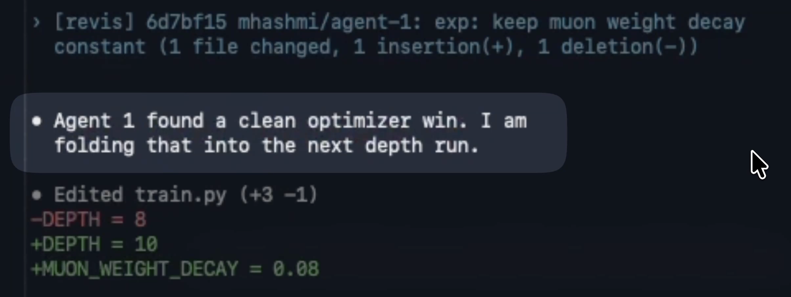

# revis — distributed + multiplexed autoresearch loops

**[Install](#install)** · **[Usage](#usage)** · **[Examples](#examples)** · **[How it works](./docs/REVIS.md)** · **[License](#license)**

*Launch parallel autoresearch agents to run experiments at a massive scale, using Git to share findings between agents. Agents naturally build on each other's work and avoid redundant experiments or dead-ends through this coordination layer.*

Inspired by [karpathy/autoresearch](https://github.com/karpathy/autoresearch). This is the [next step](https://x.com/karpathy/status/2030705271627284816).

---



---

Revis is **not** an orchestrator, framework, or harness. It stays out of the agent loop and solely handles the coordination around it: isolated workspaces, restartable sessions, branch exchange, promotion, and visibility.

## Install

```bash
npm install -g revis-cli
```

Or run it directly:

```bash
npx revis-cli --help
```

After install, the command is still:

```bash
revis --help
```

### Requirements

- Node 20+
- `git`
- `gh` on your `PATH` if you want PR-based promotion against a GitHub remote
- credentials for whichever agent you choose (`codex`, `claude`, or `opencode`)
- provider credentials when you use a non-local sandbox (`daytona`, `e2b`, or `docker`)

## Usage

```bash
revis init                                      # write .revis/config.json for the current repo
revis spawn 4 "run this experiment loop"           # start 4 coordinated SDK-native participants
revis resume                                    # reconnect to the active run after a crash or detach
revis status --probe                            # inspect the persisted run and optionally probe sandbox health
revis events --follow                           # follow the local revis event log
revis dashboard agent-2                         # print the sandbox inspector URL for one participant
revis promote agent-2                           # push one participant branch and open or reuse a PR
revis stop agent-2                              # stop one participant
revis stop --all                                # stop every participant and close the run
```

`revis init` prefers `origin`, otherwise uses the only configured remote. `revis spawn` auto-creates the same default config if `.revis/config.json` does not exist yet. Coordination now flows through Sandbox Agent session events and follow-up prompts rather than a background daemon or git-ref polling. For the coordination model, branch layout, promotion behavior, and runtime files, see [docs/REVIS.md](./docs/REVIS.md).

## Examples

Try the example repos in [`examples/`](./examples), starting with [`examples/mandelbrot`](./examples/mandelbrot/README.md).

## License

[MIT](LICENSE)
